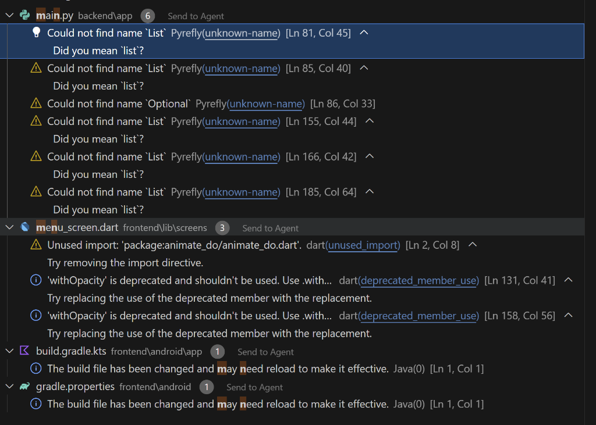

# Fine Dine - Ultra-Premium Restaurant Ordering System 🍽️✨

Welcome to **Fine Dine**, a world-class, non-AI, restaurant ordering solution built with **Flutter** and **Laravel**. Experience a seamless, high-end dining journey from QR scanning to order tracking with a stunning glassmorphism UI.

## 💎 Premium Features

- **Elegant UI/UX**: A state-of-the-art dark theme featuring glassmorphism, smooth staggered animations, and refined typography.
- **QR-Based Sessions**: Instant table identification via QR scan to start a dining session.
- **Dynamic Menu**: A beautifully categorized digital menu with real-time availability.
- **Interactive Cart**: Manage your "Feast Selection" with an intuitive glass-styled cart.
- **Live Order Tracking**: A real-time stepper dashboard to track your order from "Received" to "Delivered".
- **Manager Dashboard**: Comprehensive analytics for restaurant owners, including revenue tracking and popular dish statistics.
- **Kitchen Portal**: A dedicated interface for staff to manage active orders in real-time.

## 🛠️ Technology Stack

- **Frontend**: Flutter (Mobile/Web/Desktop)
- **Backend**: Laravel 11 (RESTful API)
- **Database**: SQLite (Optimized for local & mobile deployment)
- **Design System**: Custom Premium UI (Outfit Typography + Glassmorphism)

## 🚀 Getting Started

### Backend Setup
1. Navigate to the `backend` folder.
2. Install dependencies: `composer install`
3. Set up your `.env` file.
4. Run migrations & seed data: `php artisan migrate:fresh --seed`
5. Start the server: `php artisan serve`

### Frontend Setup
1. Navigate to the `frontend` folder.
2. Install dependencies: `flutter pub get`
3. Update `lib/services/api_service.dart` with your server IP.
4. Run the app: `flutter run`

## 📱 Mobile Deployment
For mobile testing, ensure your phone and computer are on the same Wi-Fi. Start the backend with `php artisan serve --host=0.0.0.0` and point the Flutter app to your computer's local IP address.

---
*Built with passion for the ultimate dining experience.*
