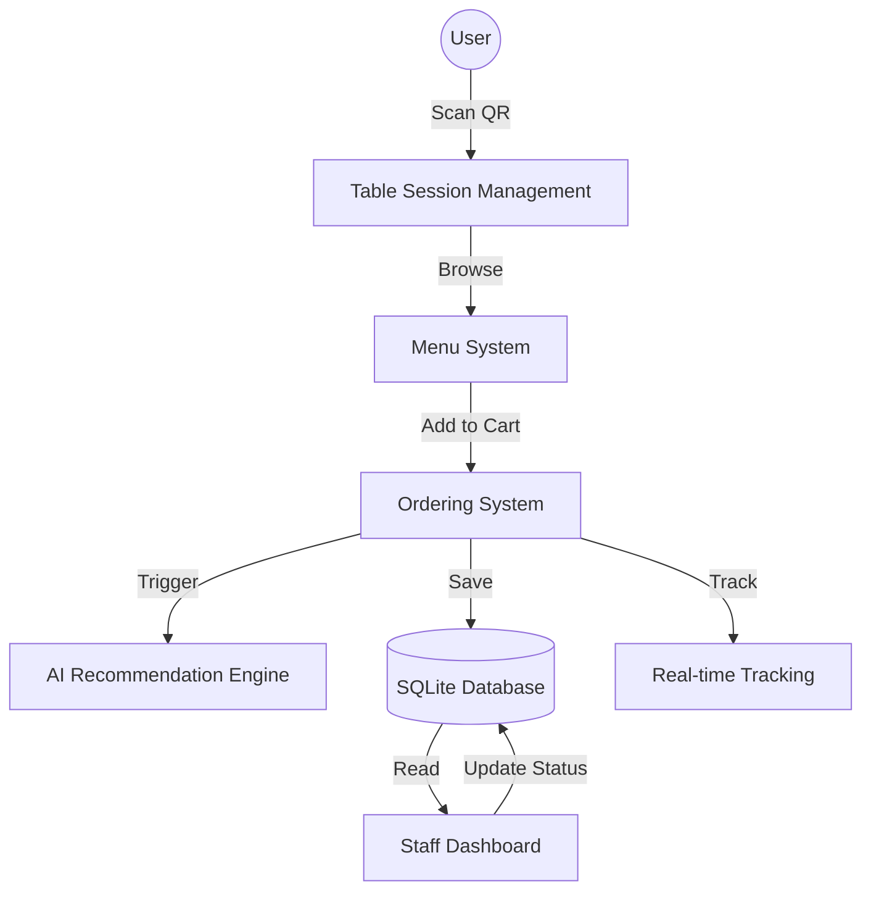

# Smart Restaurant Ordering System - Backend (Round 2)

This is the backend API for the Smart Restaurant Ordering System, built with **FastAPI** and **SQLAlchemy**.

## Features
- **QR-Based Table Sessions**: Persistent sessions linked to specific table QR codes.
- **Dynamic Menu**: Categorized menu with estimated preparation times and availability tracking.
- **Real-Time Ordering**: Session-based ordering with unique order tracking numbers.
- **Staff Dashboard**: API endpoints for staff to view and update order statuses (Received, Cooking, Ready, Delivered).
- **AI-Driven Personalization**:
    - **Smart Recommendations**: Suggests items based on current session behavior and global popularity.
    - **Intelligent Upselling**: Pairing suggestions (e.g., suggesting a drink if a main course is ordered).
    - **Prep Time Prediction**: Dynamically adjusts estimated wait times based on current kitchen load.

## Tech Stack
- **Framework**: FastAPI
- **Database**: SQLite (SQLAlchemy ORM)
- **Validation**: Pydantic
- **AI Logic**: Hybrid recommendation engine (Preferences + Popularity + Heuristic Pairing)

## System Architecture



## QR Session Logic
1. Each table has a unique `qr_code_id`.
2. When scanned, the system checks for an active session. If none exists, a new `session_token` (UUID) is generated and persisted.
3. This token is used for all subsequent interactions (ordering, tracking) to ensure data consistency even if the page is refreshed.

## AI Feature Explanation
The system uses a custom heuristic engine:
- **Session-Based Personalization**: Tracks what items the user has ordered in the current session.
- **Upselling Logic**: Specifically looks for missing categories in an order (e.g., ordering food but no beverage) and suggests items from those categories.
- **Demand Awareness**: The `prep-time-prediction` endpoint calculates a "Load Multiplier" based on the number of active orders in the kitchen, providing realistic wait times.

## Getting Started
1. Install dependencies:
   ```bash
   pip install -r requirements.txt
   ```
2. Run the server:
   ```bash
   uvicorn app.main:app --reload
   ```
3. Seed sample data:
   ```bash
   POST http://localhost:8000/seed
   ```

## API Documentation
Once running, visit `http://localhost:8000/docs` for the interactive Swagger documentation.
